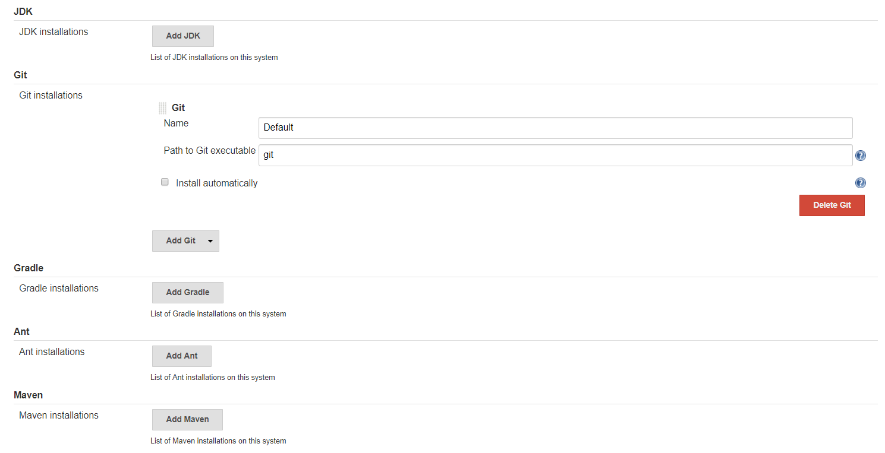
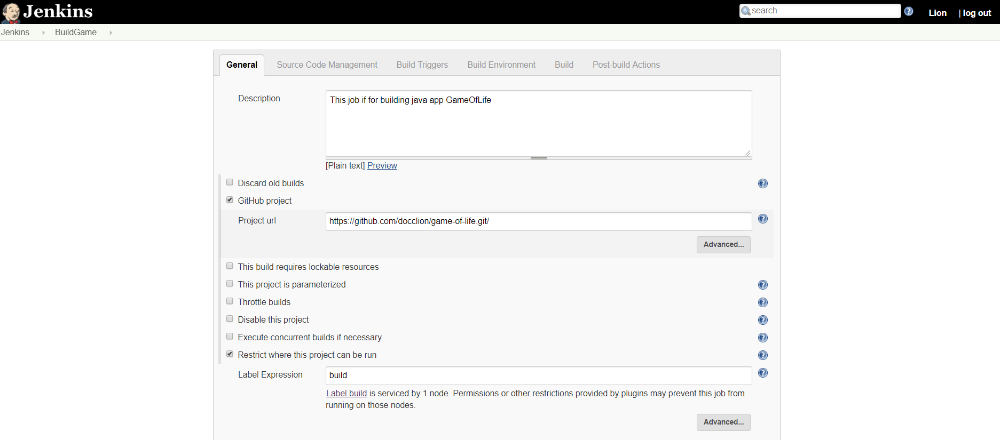
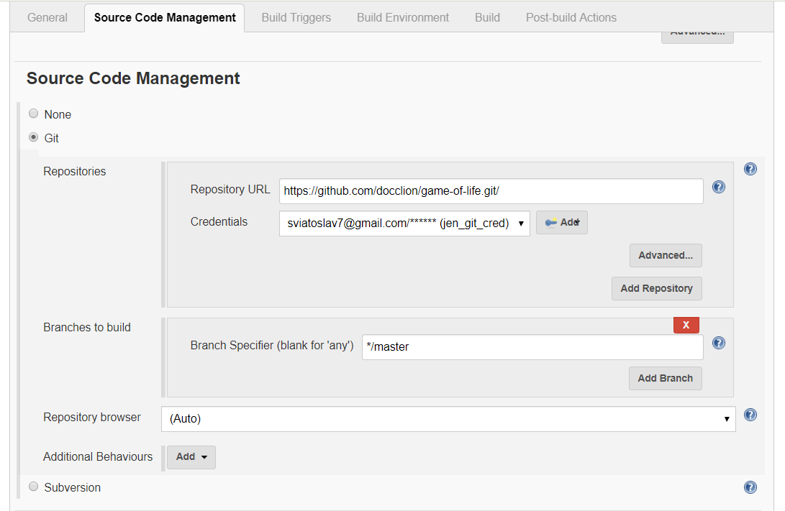
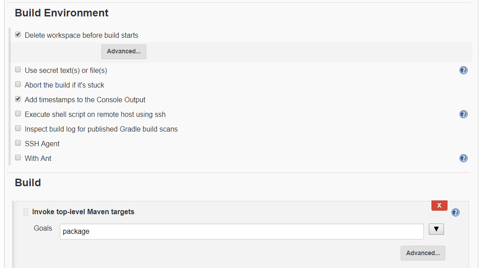
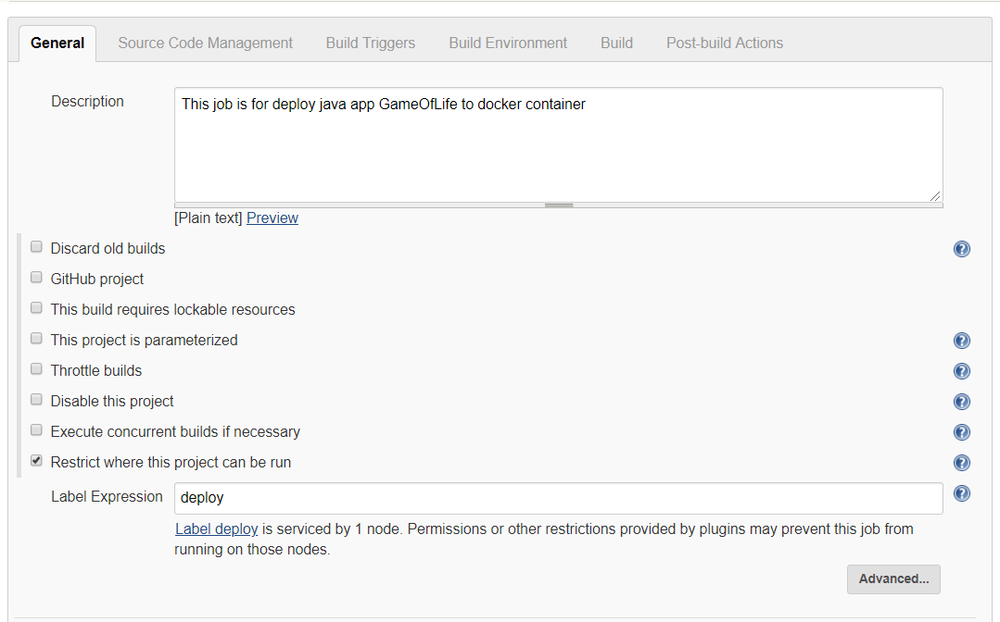
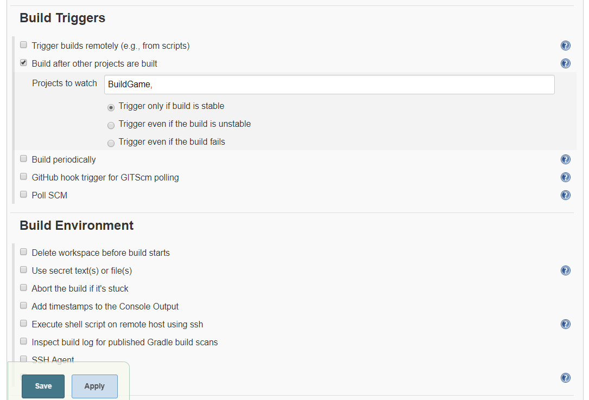
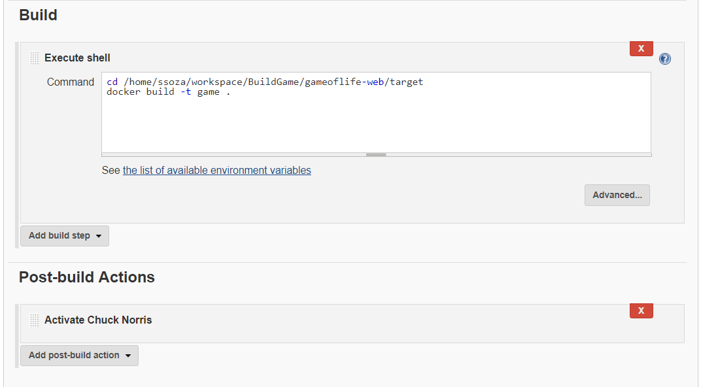
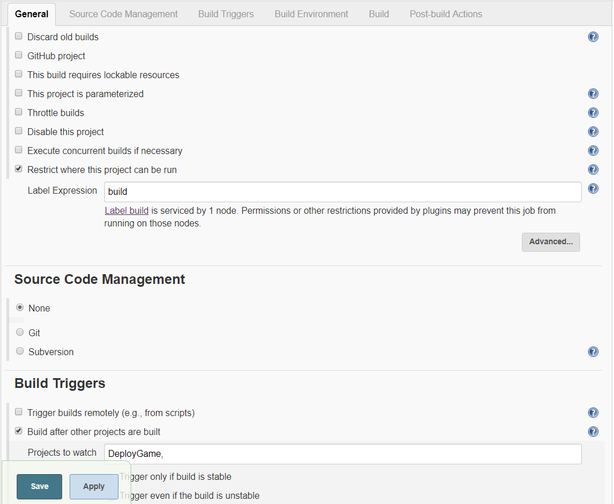
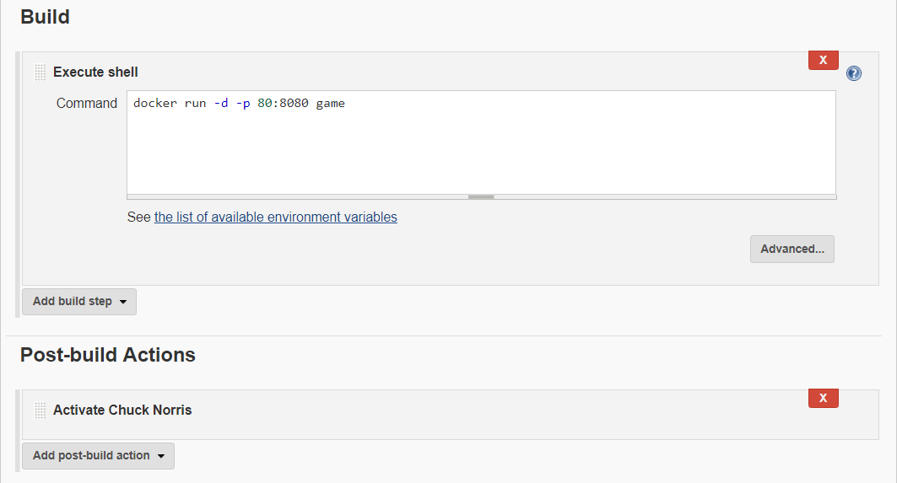
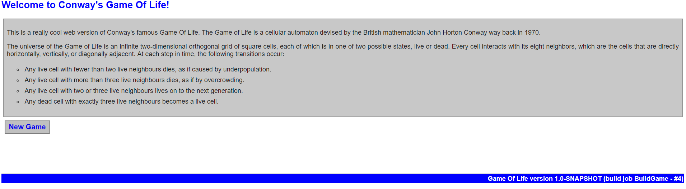

# Game Of Life

 You can find this app here https://github.com/docclion/game-of-life

# Preparing enviroments

 In this example we use Google Cloud Platform ( VM instances with Centos 7 )

# 1. First tep 

 Create VM instance on Google Cloud.
 
  

# 2. Second step

 Prepare your vm host:
  - by running scripts on host 
    ```bassh
    bash docker_inst.sh 
    bash maven_inst.sh
    ```
 
 - or run ansible playbooks ( before that prepare your ansbile by specify your vm instance ip in /etc/ansible/hosts and credentials): 
   ```bash
   ansible-playbook docker.yml 
   ansible-playbook maven.yml
   ```
   
 # 3. Third step
 
  Configuring Jenkins master
   - added 2 new nodes ( specify labels and numbers of executors)
    
   
   
   
   
   - configure your jenkins with github ( added webhook and credentials)
    
   

# 4. Fourth step

 Creating job for building.
  - install java and maven with scripts or use ansible or use jenkins installation;
  
  
  
  - Build job -its Github project with label build. Source Code Management - Git. In this case we use GitHub hook trigger for GITScm polling, so after some push changes into our branch this job will start. Some build enviroment configuration. Build - Maven targets with goal package.
  
   
   
   
   
   
   
# 5. Fifth step

 Creating job for deploy war file into docker container.
 Label expression - deploy. Build triggers - after project BuildGame build and stable.
  
   
  
  
 
 Build - Execute shell
 
  ```bash
  cd /home/ssoza/workspace/BuildGame/gameoflife-web/target
  docker build -t game .
  ```
  
  
  
# 6. Sixth step

 Creating job for start docker container with Game Of Life.
 Label Expression - build. Build triggers - after project DeployGame.
  
  
  
 Build - execute shell

  
  
  
 # Game Of Life
 
  

# Seventh step

 Delpoy docker container to Kubernets cluster.
  
  
 


  
