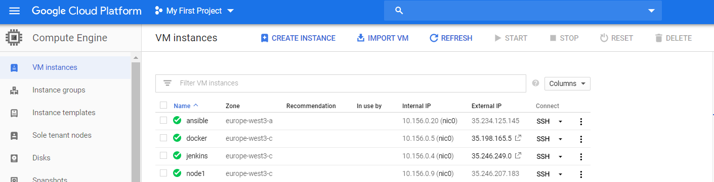
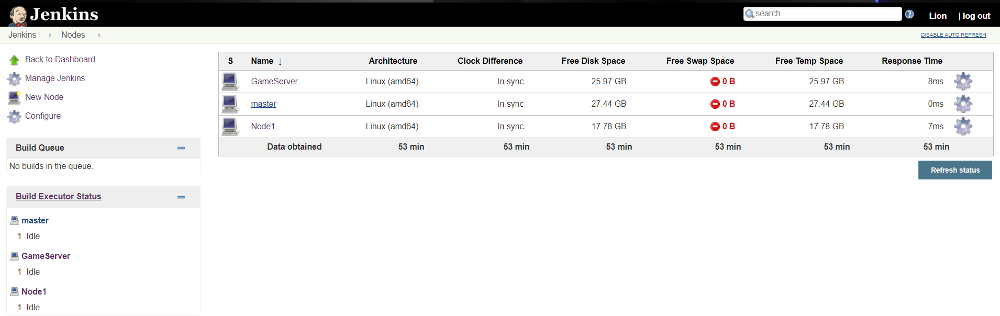
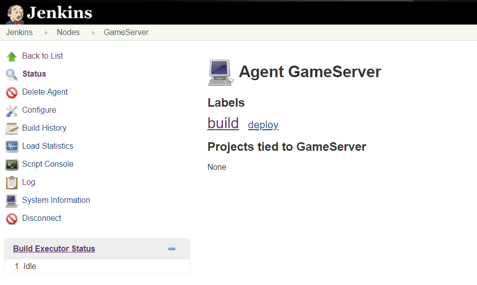
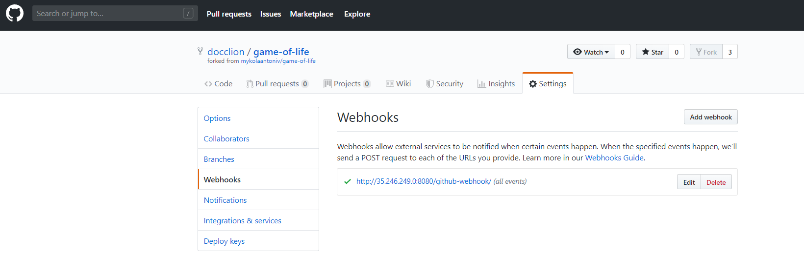

# Game Of Life

 You can find this app here https://github.com/docclion/game-of-life

# Preparing enviroments

 In this example we use Google Cloud Platform ( VM instances with Centos 7 )

# 1. First tep 

 Create VM instance on Google Cloud.
 
  

# 2. Second step

 Prepare your vm host:
  - by running scripts on host 
    ```bassh
    bash docker_inst.sh 
    bash maven_inst.sh
    ```
 
 - or run ansible playbooks ( before that prepare your ansbile by specify your vm instance ip in /etc/ansible/hosts and credentials): 
   ```bash
   ansible-playbook docker.yml 
   ansible-playbook maven.yml
   ```
   
 # 3. Third step
 
  Configuring Jenkins master
   - added 2 new nodes ( specify labels and numbers of executors)
    
   
   
   
   
   - configure your jenkins with github ( added webhook and credentials)
    
   

    - 
